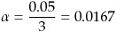

Statistical Inference Course Project Response 2
================================

**Principal Author**  
Dr. John R. Withrow Jr.  
Cherokee Nation Technologies  
Contractor for USDA-FS FHTET  
NRRC Building A Ste 331  
2150 Centre Avenue  
Fort Collins, CO 80526  
johnwithrow@fs.fed.us  

```{r setup, include=FALSE}
knitr::opts_chunk$set(echo = TRUE)
```

### Executive Summary
The dataset ToothGrowth is analyzed, in particular to assess associations between odontoblast growth in guinea pigs and Vitamin C dosage and delivery method.  A positive association between odontoblast growth and Vitamin C dosage is statistically detected.

***

### Analytical Context
#### Scientific Discussion
This document described the analysis of an existing dataset.  All analyses were done in compliance with industry-standard techniques as described in the present course in Statistical Inference and reported using state-of-the-art techniques as described in a preceeding course in Reproducible Research.

Analysis is performed on the "ToothGrowth" dataset in R, which according to available documentation, is based upon the work of Crampton (1947) who investigated the effect of Vitamin C on tooth growth in guinea pigs.  The response variable is the length of odontoblasts (cells responsible for tooth growth) in 60 guinea pigs. Each animal received one of three dose levels of vitamin C (0.5, 1, and 2 mg/day) by one of two delivery methods, (orange juice or ascorbic acid (a form of vitamin C and coded as VC).

#### Software Environment 
```{r sessionInfo}
sessionInfo()
```
Random Number Seed: 19680828
```{r rnd seed}
set.seed(19680828)
```

***

### Analytical Process
#### Data Acquisition

For this analysis we used the "ToothGrowth" dataset available via the R datasets package:

```{r loaddata}
data("ToothGrowth")
```

#### Data Description

Initial investigations of the ToothGrowth dataset are as follows:

```{r initial}
str(ToothGrowth)
head(ToothGrowth)
```

It shows a single R data frame of sixty observations of three variables.  

#### Exploratory data analysis

Tables and histograms of these three variables are as follows:

```{r histograms}
table(ToothGrowth$supp)
par(mfrow=c(1,2))
hist(ToothGrowth$dose,xlab="Dose (mm/day)",main="Histogram of Vitamin C Dosage",col="blue")
hist(ToothGrowth$len,xlab="Length",main="Histogram of Odontoblast Growth",col="blue")
par(mfrow=c(1,1))
```

The table of supp values shows an even split between guinea pigs who received Vitamin C by way of orange juice (OJ) and ascorbic acid (VC).  The histogram of Vitamin C dosages shows an even split between three different dosage levels, which according to the documentation are in milligrams per day.  Units are not provided for odontoblast lengths, shown in the second histogram with values ranging from zero to 35.

To explore relationships between odontoblast lengths and Vitamin C dosage, three separate histograms are shown with statistics:

```{r histbydose}
par(mfrow=c(1,3))
hist(ToothGrowth$len[ToothGrowth$dose == 0.5],xlim=c(0,35),xlab="Length",main="Dosage of 0.5mm/day",col="blue")
hist(ToothGrowth$len[ToothGrowth$dose == 1],xlim=c(0,35),xlab="Length",main="Dosage of 1.0mm/day",col="blue")
hist(ToothGrowth$len[ToothGrowth$dose == 2],xlim=c(0,35),xlab="Length",main="Dosage of 2.0mm/day",col="blue")
par(mfrow=c(1,1))
z <- c(mean(ToothGrowth$len[ToothGrowth$dose == 0.5]),mean(ToothGrowth$len[ToothGrowth$dose == 1]),mean(ToothGrowth$len[ToothGrowth$dose == 2]))
```

| Mean Growth with Dose 0.5 | Mean Growth with Dose 1.0 | Mean Growth with Dose 2.0 |
|---------------------------|---------------------------|---------------------------|
| `r z[1]`                  | `r z[2]`                  | `r z[3]`                  |

```{r histbysupp}
par(mfrow=c(1,2))
hist(ToothGrowth$len[ToothGrowth$supp == 'OJ'],xlim=c(0,35),xlab="Length",main="Method of Orange Juice",col="blue")
hist(ToothGrowth$len[ToothGrowth$supp == 'VC'],xlim=c(0,35),xlab="Length",main="Method of Ascorbic Acid",col="blue")
par(mfrow=c(1,1))
z <- c(mean(ToothGrowth$len[ToothGrowth$supp == 'OJ']),mean(ToothGrowth$len[ToothGrowth$supp == 'VC']))
```

| Mean Growth with OJ | Mean Growth with VC |
|---------------------|---------------------|
| `r z[1]`            | `r z[2]`            |

Based upon these initial findings, it is suspected that odontoblast growth may be directly proportional to Vitamin C dosage, and that the use of orange juice as a delivery mechanism may be more effective than ascorbic acid.

#### Statistical prediction/modeling

First we investigate the relationship between odontoblast growth and delivery mechanism using a simple t test (Ott 1993):
```{r stats01}
t.test(ToothGrowth$len ~ ToothGrowth$supp)
```

We (albeit marginally) fail to detect a significant difference in the effect of delivery mechanism on odontoblast growth (t=1.1953, p=0.0606).  

To investigate effects of dosage, three t-tests were required, each one comparing two of the three available dosage levels.  To account for possible issues of simultaneous inference, a Bonferroni adjustment (Neter et al. 1996) was made to the signficance level:



Results are as follows:

```{r stats02}
means <- c(mean(ToothGrowth$len[ToothGrowth$dose == 0.5]),mean(ToothGrowth$len[ToothGrowth$dose == 1.0]),mean(ToothGrowth$len[ToothGrowth$dose == 2.0]))
fmeans <- format(means,digits=2,nsmall=2)
vars <- c(var(ToothGrowth$len[ToothGrowth$dose == 0.5]),var(ToothGrowth$len[ToothGrowth$dose == 1.0]),var(ToothGrowth$len[ToothGrowth$dose == 2.0]))
fvars <- format(vars,digits=2,nsmall=2)
ns <- c(length(ToothGrowth$len[ToothGrowth$dose ==0.5]),length(ToothGrowth$len[ToothGrowth$dose ==1.0]),length(ToothGrowth$len[ToothGrowth$dose ==2.0]))
ses <- c(sqrt(vars[1]/ns[1]),sqrt(vars[2]/ns[2]),sqrt(vars[3]/ns[3]))
fses <- format(ses,digits=2,nsmall=2)
cis <- c(means[1]+c(-1,1)*ses[1]*qt(1-0.05/3,ns[1]),means[2]+c(-1,1)*ses[2]*qt(1-0.05/3,ns[2]),means[3]+c(-1,1)*ses[3]*qt(1-0.05/3,ns[3]))
ci1 <- paste("(",format(cis[1],digits=2,nsmall=2),",",format(cis[2],digits=2,nsmall=2),")")
ci2 <- paste("(",format(cis[3],digits=2,nsmall=2),",",format(cis[4],digits=2,nsmall=2),")")
ci3 <- paste("(",format(cis[5],digits=2,nsmall=2),",",format(cis[6],digits=2,nsmall=2),")")
TG1 <- subset(ToothGrowth,dose %in% c(0.5,1))
TG2 <- subset(ToothGrowth,dose %in% c(1,2))
TG3 <- subset(ToothGrowth,dose %in% c(0.5,2))
TT1 <- t.test(TG1$len ~ TG1$dose,conf.level=1-0.05/3)
TT2 <- t.test(TG2$len ~ TG2$dose,conf.level=1-0.05/3)
TT3 <- t.test(TG3$len ~ TG3$dose,conf.level=1-0.05/3)
stat1 <- paste("t = ",format(TT1$statistic,digits=2,nsmall=2),", p = ",format(TT1$p.value,digits=2,nsmall=2))
stat2 <- paste("t = ",format(TT2$statistic,digits=2,nsmall=2),", p = ",format(TT2$p.value,digits=2,nsmall=2))
stat3 <- paste("t = ",format(TT3$statistic,digits=2,nsmall=2),", p = ",format(TT3$p.value,digits=2,nsmall=2))
```

|Dosage Level|Mean Length    |Std Error    |Conf. Int|1.0        |2.0        |
|------------|---------------|-------------|---------|-----------|-----------|
| 0.5 mm/day | `r fmeans[1]` | `r fses[1]` | `r ci1` | `r stat1` | `r stat3` |
| 1.0 mm/day | `r fmeans[2]` | `r fses[2]` | `r ci2` |           | `r stat2` |
| 2.0 mm/day | `r fmeans[3]` | `r fses[3]` | `r ci3` |           |           |

The results show that, even with the Bonferroni adjustment, all differences were statistically significant, supporting the conclusion that there is a statistical association between odontoblast growth and Vitamin C dosage. 

### Conclusion
We conclude that there is statistical support for the notion that odontoblast growth is positively associated with Vitamin C dosage.  The notion that odontoblast growth is associated with mode of delivery is not conclusively supported, but it should be noted that there is some indication that orange juice may be a better mechanism.  Further study on this may be warranted.

***

### References
- Crampton EW 1947. The growth of the odontoblast of the incisor teeth as a criterion of vitamin C intake of the guinea pig, The Journal of Nutrition 33(5): 491-504, http://jn.nutrition.org/content/33/5/491.full.pdf.  
- Neter J, Kutner MH, Nachtsheim CJ, Wasserman W 1996. Applied linear statistical models, fourth edition, WCB McGraw-Hill, 1408pp.  
- Ott RL 1993. An introduction to statistical methods and data analysis, Fourth Edition, Duxbury Press, 1051pp.  

***

#### End of Analysis
